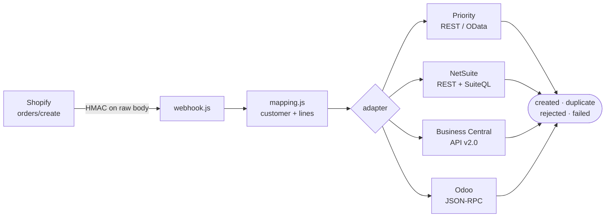

# Shopify → ERP Order Sync

   [](LICENSE)

A Node.js webhook service that turns a Shopify `orders/create` into a sales order in **Priority,
NetSuite, Dynamics 365 Business Central or Odoo** — one adapter per ERP, no dependencies, Node 20+.



```bash
npm test                                          # 20 integration tests, all four adapters
ERP=priority PRIORITY_URL=... node src/cli.js samples/order-b2b.json
npm start                                         # the webhook server
```

## What it handles

**Webhook authenticity.** The HMAC is verified against the *raw* body before anything is parsed —
`src/webhook.js`.

**Mapping.** B2B buyers are matched by e-mail to their ERP customer code (`CUSTOMER_BY_EMAIL`);
everyone else goes to a generic web customer. Lines without a SKU are dropped rather than guessed at
— `src/mapping.js`.

**Idempotency.** Shopify resends webhooks, and a retry must not create a second order. Each adapter
checks first, using whatever the platform gives it:

| ERP | Idempotent on | How |
|---|---|---|
| Priority | `BOOKNUM` | REST/OData deep insert through `ORDERITEMS_SUBFORM` |
| NetSuite | external id | upsert `salesOrder/eid:<id>`, SuiteQL lookups |
| Business Central | `externalDocumentNumber` | API v2.0 deep insert |
| Odoo | `client_order_ref` | JSON-RPC `execute_kw` |

**Retries that know the difference.** Network errors, `429` and `5xx` back off and retry. Business
errors — over credit limit, unknown part — never do; retrying them just repeats the rejection
(`src/http.js`, `src/errors.js`).

**An honest result.** Every sync returns `created | duplicate | rejected | failed`, and the server
answers Shopify `503` only for `failed`. A `rejected` order is a definitive answer, so Shopify is
told to stop resending it.

## Tests

`npm test` runs all four adapters against `mock-erp-api` — the happy path, a resent webhook, a
credit-limit rejection and an unknown part, for each ERP:

```
▶ mapping                      ✔
▶ webhook signature            ✔
▶ priority adapter             ✔
▶ netsuite adapter             ✔
▶ business-central adapter     ✔
▶ odoo adapter                 ✔
▶ webhook server               ✔

ℹ tests 20   ℹ suites 7   ℹ pass 20   ℹ fail 0
```

No licensed sandboxes and no network: the mocks run in-process.

## `mock-erp-api/`

An in-memory stand-in for all four ERP APIs, reproducing each one's request, response and error
shapes — and enforcing the same credit-limit rule the native code does, with the same message. That
is what makes the rejection path testable end to end without four licensed sandboxes.

## Configuration

Copy `.env.example` to `.env`. No real credentials are in this repo.

---

## The same scenario, other platforms

Open orders by customer, a hard credit-limit block, and a Shopify order feed — built natively on each ERP:

- [Priority — Credit Control](https://github.com/Milo-ai-HQ/priority-credit-control)
- [Priority — Order Load Interface](https://github.com/Milo-ai-HQ/priority-order-load-interface)
- [NetSuite — Sales Controls](https://github.com/Milo-ai-HQ/netsuite-sales-controls)
- [Business Central — Sales Controls](https://github.com/Milo-ai-HQ/business-central-sales-controls)
- [Odoo — Sales Controls](https://github.com/Milo-ai-HQ/odoo-sales-controls)
